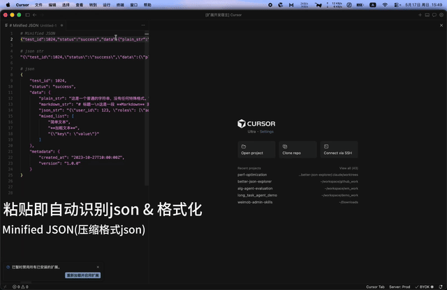
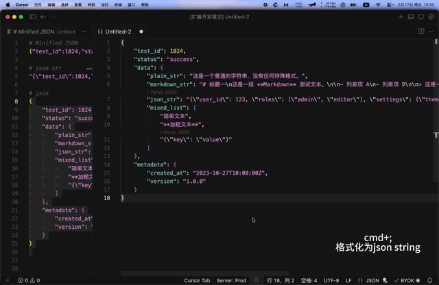

# JSON Explorer

迁移自 Better JSON Explorer 0.2.1。当前作为 Context Kit 的功能模块提供。

## 功能演示

### 1. 智能识别与格式化



### 2. JSON 格式一键切换（默认 Cmd+;）



### 3. 任意字符串 Hover 预览与嵌套解析


## 功能

1. **智能识别与格式化**：在 plaintext 文件粘贴时，扩展会按内容分三类处理：

   | 内容类型                                                                                                        | 默认行为                                                                            | 可通过设置改成"粘贴即转" |
   | --------------------------------------------------------------------------------------------------------------- | ----------------------------------------------------------------------------------- | ------------------------ |
   | 合法 JSON 或 JSON 字符串                                                                                        | **自动**切换语言模式并格式化                                                        | —                        |
   | Python `repr(dict)` 字面量（单引号/`True/False/None`/tuple 等）                                                 | 顶部显示按钮 **`▸ Convert Python dict to JSON`**，点击或按 `Cmd+;` 转换             | ✓                        |
   | 含字符串内真换行的 JSON（终端/日志聚合工具复制场景，JSON.parse 会报 `Bad control character in string literal`） | 顶部显示按钮 **`▸ Convert to JSON (fix line breaks)`**，点击或按 `Cmd+;` 修复并转换 | ✓                        |

   后两类默认走"显示按钮 → 用户确认"模式，避免静默改写可能是真实 Python 源码 / 待检查内容的输入；用户可以通过配置改成"粘贴即转"。

2. **JSON 格式切换**：JSON/JSONC 文件中使用默认快捷键 `Cmd+;`（Windows/Linux 为 `Ctrl+;`）在 JSON 格式和 JSON 字符串之间切换；在 plaintext 文件中（当顶部转换按钮可见时）该快捷键等价于点击按钮，转换后语言模式切到 JSON，再按一次即进入上述 toggle 链路
3. **任意字符串值的 Hover 预览**：JSON 中所有 string 值都支持鼠标悬停预览，并按内容智能选择渲染方式
   - **嵌套 JSON**（如 `"{\"a\":1}"`）→ 展开为格式化 JSON 渲染
   - **Python dict 字符串**（如 `"{'a': 1, 'ok': True}"`）→ 转为 JSON 后展开渲染，Hover 标题为 "Parsed Python dict"
   - **Markdown 文本**（标题/列表/代码围栏/链接/表格等）→ 直接以 markdown 渲染
   - **纯文本/代码** → code block 等宽显示，转义字符（`\n`/`\t`）按真实换行/制表展示
   - 超大内容预览自动截断（保留前 2000 字符），截断时显示省略提示，避免浮窗被撑爆
   - Hover 浮窗**顶部第二行**和**底部**各带一个 `▸ Open ... in side panel` 链接，点击在右侧分栏新开 untitled 文档：
     - 嵌套 JSON → `Parsed-<keyPath>.json`
     - Python dict → `Parsed-py-<keyPath>.json`
     - Markdown → `Value-<keyPath>.md`（可用 `Cmd+Shift+V` 触发 markdown 预览）
     - 纯文本 → `Value-<keyPath>.txt`
   - 多次点击会在右侧同一分栏增加 Tab，互不覆盖；新文档本身也是 JSON / Markdown 文档，因此**递归支持任意深度嵌套**
4. **嵌套 JSON 字符串 CodeLens**：可解析为 JSON 对象/数组的字符串值上方会显示 `▸ Parse JSON`（或 `▸ Parse Python dict`）行内按钮，等价于 Hover 链接的快捷入口（纯文本/markdown 不会显示 CodeLens，避免噪音）

### Python dict 支持范围

支持 `ast.literal_eval` 的子集：`dict` / `list` / `tuple`（转为数组） / `str`（单/双/三引号） / `int` / `float` / `True` / `False` / `None`。下列**不支持**，输入会被原样保留（不会误转、不会报错）：

- 含函数调用（如 `datetime(2024, 1, 1)`、`UUID('...')`、`Decimal('1.5')`）
- 含对象引用（如 `<Foo object at 0x100>`）
- bytes 字面量（`b'...'`）
- set 字面量（`{1, 2, 3}` 无键值对形式）
- 非字符串 key 的 dict（如 `{1: 'a'}`，因 JSON 仅支持字符串 key）

## 配置

在 VS Code 命令面板执行 **Preferences: Open User Settings (JSON) / 首选项: 打开用户设置 (JSON)**，将配置写入顶层对象。只对当前项目生效时，写入项目的 `.vscode/settings.json`；工作区设置优先于用户设置。

如果文件已有设置，把下面示例里的字段合并到现有对象，不要再嵌套一个对象。布尔值写 `true` / `false`，数字不加引号。所有配置修改后即时生效，无需重载窗口。

### 完整配置：默认行为

```json
{
  "contextKit.jsonExplorer.enabled": true,
  "contextKit.jsonExplorer.pythonRepr.autoConvert": false,
  "contextKit.jsonExplorer.lineBreakRepair.autoConvert": false
}
```

### 每个字段的含义与写法

| 字段                                                  | 类型 / 默认值     | 含义与取值                                                                                                                                                                                        |
| ----------------------------------------------------- | ----------------- | ------------------------------------------------------------------------------------------------------------------------------------------------------------------------------------------------- |
| `contextKit.jsonExplorer.enabled`                     | boolean / `true`  | **整个 JSON Explorer 的总开关**。`false` 时关闭自动识别/格式化、转换命令、快捷键、Hover 和 CodeLens；不会修改现有文档或关闭已打开的解析文档，也不影响 Copy Anchor。                               |
| `contextKit.jsonExplorer.pythonRepr.autoConvert`      | boolean / `false` | 仅在总开关开启时有效。`false` 时可解析的 Python repr 显示转换按钮，点击或按 Ctrl+; / Cmd+; 后转换；`true` 时在 plaintext 整体粘贴检测命中时自动转为 JSON，不显示 Python 转换按钮。                |
| `contextKit.jsonExplorer.lineBreakRepair.autoConvert` | boolean / `false` | 仅在总开关开启时有效。`false` 时含字符串内真实换行的 JSON 显示修复转换按钮；`true` 时在 plaintext 整体粘贴检测命中时自动修复并转为 JSON，不显示对应修复按钮。正常 JSON 的结构换行不会被当成错误。 |

单个字段写法分别为 `"contextKit.jsonExplorer.enabled": false`、`"contextKit.jsonExplorer.pythonRepr.autoConvert": true` 和 `"contextKit.jsonExplorer.lineBreakRepair.autoConvert": true`。

两个 `autoConvert` 独立控制各自的修复场景，**不是模块总开关**。总开关开启时，合法 JSON 和 JSON 字符串仍会按原有规则自动识别/格式化，不受这两项控制。修改 `autoConvert` 只影响后续操作和按钮显示，不会追溯转换现有内容。

### 完整示例：自动转换两种特殊输入

```json
{
  "contextKit.jsonExplorer.enabled": true,
  "contextKit.jsonExplorer.pythonRepr.autoConvert": true,
  "contextKit.jsonExplorer.lineBreakRepair.autoConvert": true
}
```

### 完整示例：关闭整个功能

```json
{
  "contextKit.jsonExplorer.enabled": false,
  "contextKit.jsonExplorer.pythonRepr.autoConvert": false,
  "contextKit.jsonExplorer.lineBreakRepair.autoConvert": false
}
```

重新启用只需把 `enabled` 改回 `true`；其他设置保留。总开关只控制本模块，VS Code 自带或其他扩展的 JSON 能力不受影响。

## 快捷键

| 操作                                          | Windows / Linux | macOS | 命令 ID                                         |
| --------------------------------------------- | --------------- | ----- | ----------------------------------------------- |
| 切换 JSON / JSON 字符串，或转换当前 plaintext | Ctrl+;          | Cmd+; | `contextKit.jsonExplorer.toggleCurrentDocument` |

JSON/JSONC 中切换 JSON 与 JSON 字符串；plaintext 中仅在转换按钮可见时转换 Python repr 或修复 JSON 换行。普通文本或无可转换内容时不修改文档。其他语言不触发；`contextKit.jsonExplorer.enabled` 为 `false` 时绑定不生效。

快捷键使用 **用户 `keybindings.json`**，不写在 `settings.json` 中，也不是项目的 `.vscode/keybindings.json`。命令面板执行 **Preferences: Open Keyboard Shortcuts (JSON) / 首选项: 打开键盘快捷方式 (JSON)** 即可编辑。也可以打开键盘快捷方式界面，搜索下面的命令 ID 后修改按键。

文件顶层是 **数组 `[]`**。已有配置时，将示例中的条目加入原数组，不要覆盖已有条目或嵌套第二个数组。以下示例分别独立使用，不要将默认版与自定义版同时粘贴。

| 字段      | 含义与写法                                                                                                                                                           |
| --------- | -------------------------------------------------------------------------------------------------------------------------------------------------------------------- |
| `key`     | 按键组合，小写书写，例如 `ctrl+alt+j`；macOS 的 Command 写作 `cmd`，Control 写作 `ctrl`。空格分隔两段式快捷键；JSON 字符串中的反斜杠写作 `\\`。                      |
| `command` | 要调用的命令 ID。以 `-` 开头表示移除扩展提供的默认绑定，不是执行命令。                                                                                               |
| `when`    | 生效条件。保留 `config.…enabled`，确保整个功能关闭后释放快捷键；`editorTextFocus` 限定编辑器正文焦点，`editorHasSelection` 限定有选区，`isMac` / `!isMac` 区分系统。 |

快捷键中的 `config.…enabled` 读取 `settings.json` 的总开关；它不是需要额外创建的设置。修改后即时生效。新增一个绑定不会自动删除原默认绑定，所以改键示例同时包含移除条目。若以前添加过相同命令的用户绑定，还需在原数组里手动删除那些旧条目。

### 完整示例：默认快捷键（跨平台）

扩展已提供默认绑定；无需修改时不必填写。

```json
[
  {
    "key": "ctrl+;",
    "command": "contextKit.jsonExplorer.toggleCurrentDocument",
    "when": "config.contextKit.jsonExplorer.enabled && editorTextFocus && (editorLangId == json || editorLangId == jsonc || editorLangId == plaintext) && !isMac"
  },
  {
    "key": "cmd+;",
    "command": "contextKit.jsonExplorer.toggleCurrentDocument",
    "when": "config.contextKit.jsonExplorer.enabled && editorTextFocus && (editorLangId == json || editorLangId == jsonc || editorLangId == plaintext) && isMac"
  }
]
```

### 完整示例：改为 Ctrl+Alt+J / Cmd+Alt+J

先移除系统对应的默认 Ctrl+; / Cmd+;，再设置新按键。两个移除条目可以一起保留，不匹配当前系统的条目不会移除其他命令。

```json
[
  {
    "key": "ctrl+;",
    "command": "-contextKit.jsonExplorer.toggleCurrentDocument",
    "when": "config.contextKit.jsonExplorer.enabled && editorTextFocus && (editorLangId == json || editorLangId == jsonc || editorLangId == plaintext)"
  },
  {
    "key": "cmd+;",
    "command": "-contextKit.jsonExplorer.toggleCurrentDocument",
    "when": "config.contextKit.jsonExplorer.enabled && editorTextFocus && (editorLangId == json || editorLangId == jsonc || editorLangId == plaintext)"
  },
  {
    "key": "ctrl+alt+j",
    "command": "contextKit.jsonExplorer.toggleCurrentDocument",
    "when": "config.contextKit.jsonExplorer.enabled && editorTextFocus && (editorLangId == json || editorLangId == jsonc || editorLangId == plaintext) && !isMac"
  },
  {
    "key": "cmd+alt+j",
    "command": "contextKit.jsonExplorer.toggleCurrentDocument",
    "when": "config.contextKit.jsonExplorer.enabled && editorTextFocus && (editorLangId == json || editorLangId == jsonc || editorLangId == plaintext) && isMac"
  }
]
```

`contextKit.jsonExplorer.convertToJsonInPlace` 和 `contextKit.jsonExplorer.parseNestedJson` 没有默认快捷键：前者由转换按钮或上述切换命令调用，后者需要 CodeLens 提供待解析内容。一般只需自定义表中的切换命令。

## 示例

把下面这段贴进一个 JSON 文件，悬停每个 string 值观察 Hover 不同表现：

````json
{
  "test_id": 1024,
  "status": "success",
  "data": {
    "plain_str": "这是一个普通的字符串，没有任何特殊格式。",
    "markdown_str": "# 标题一\n这是一段 **Markdown** 测试文本。\n\n- 列表项 A\n- 列表项 B\n\n> 这是一个引用块。\n\n`inline code` 和代码块：\n\n```python\nprint('hello world')\n```",
    "json_str": "{\"user_id\": 123, \"roles\": [\"admin\", \"editor\"], \"settings\": {\"theme\": \"dark\", \"notifications\": true}}",
    "mixed_list": ["简单文本", "**加粗文本**", "{\"key\": \"value\"}"]
  },
  "metadata": {
    "created_at": "2023-10-27T10:00:00Z",
    "version": "1.0.0"
  }
}
````

预期 Hover 行为：

| 字段                                                                    | Hover 类型                                                   | 右侧打开为 |
| ----------------------------------------------------------------------- | ------------------------------------------------------------ | ---------- |
| `status` / `metadata.version` / `data.plain_str` / `data.mixed_list[0]` | **String value**（code block 等宽）                          | `.txt`     |
| `data.markdown_str`                                                     | **Markdown**（标题/列表/引用/代码块原生渲染）                | `.md`      |
| `data.json_str` / `data.mixed_list[2]`                                  | **Parsed JSON**（同时显示 CodeLens `▸ Parse JSON`）          | `.json`    |
| `data.mixed_list[1]` `"**加粗文本**"`                                   | **String value**（长度不足 20 字符 + 单一信号，归类为 text） | `.txt`     |

## 开发结构

- `index.ts`：注册命令、文档事件和 provider，持有并释放模块资源。
- `core/`：纯逻辑，包括 JSON/Python 解析、换行修复、Markdown 识别及 Hover token 缓存。不依赖 VS Code API。
- `documentValues.ts`：把核心算法的 offset/length 映射为编辑器 Range。
- `commands.ts`、`parseNestedCommand.ts`、`editorOps.ts`：转换、侧栏文档和编辑器操作。
- `providers/`：Hover 和 CodeLens。
- `config.ts`：`contextKit.jsonExplorer.*` 配置。
- `logger.ts`：接入入口传入的共用日志通道，不创建额外通道。

保留原有全量替换检测、格式化并发锁、Hover 短 token 和版本缓存行为。注册命令返回完成 Promise，便于调用方等待编辑完成。转换 CodeLens 的配置监听器与 EventEmitter 随模块释放。
